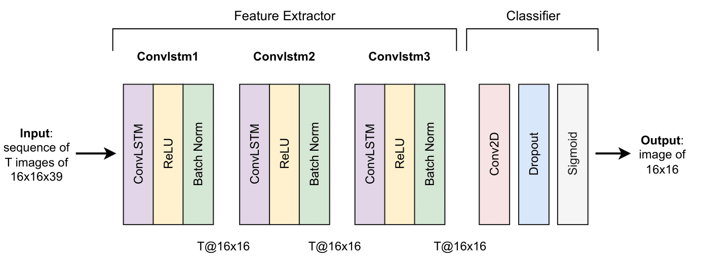

# DL-crime-forecasting-mobility

This repository contains all the code used for the paper "Deep Learning for Crime Forecasting: The Role of Mobility at Fine-grained Spatiotemporal Scales" by Ariadna Albors Zumel, Michele Tizzoni, and Gian Maria Campedelli.

📄 You can find the full paper here:

## Introduction

**Objectives:** To develop a deep learning framework to evaluate if and how incorporating micro-level mobility features, alongside historical crime and sociodemographic data, enhances predictive performance in crime forecasting at fine-grained spatial and temporal resolutions.

**Methods:** We advance the literature on computational methods and crime forecasting by focusing on four U.S. cities (i.e., Baltimore, Chicago, Los Angeles, and Philadelphia). We employ crime incident data obtained from each city's police department, combined with sociodemographic data from the American Community Survey and human mobility data from Advan, collected from 2019 to 2023. This data is aggregated into grids with equally sized cells of 0.077 sq. miles (0.2 sq. kms) and used to train our deep learning forecasting model that predicts crime occurrences 12 hours ahead using 14-day and 2-day input sequences.

**Results:** Incorporating mobility features improves predictive performance, especially when using shorter input sequences. Noteworthy, however, the best results are obtained when both mobility and sociodemographic features are used together, with our deep learning model achieving the highest recall, precision, and F1 score in all four cities, outperforming alternative methods. With this configuration, longer input sequences enhance predictions for violent crimes, while shorter sequences are more effective for property crimes.

**Conclusion:** These findings underscore the importance of integrating diverse data sources for spatiotemporal crime forecasting, mobility included. They also highlight the advantages (and limits) of deep learning when dealing with fine-grained spatial and temporal scales.

## Code structure

The code is separated into two main folders and structured as follows.

### Preprocessing
- sociodemographic_data:
  1. Download the data from the [American Community Survey (ACS)](https://www2.census.gov/geo/tiger/TIGER_DP/) (specifically the files containing BG_06, BG_17, BG_24, and GB_42 for the year 2019, 2020 and 2021) and put in a folder named "raw_data".
  2. `1-preprocess_data_sociodem_datasets.py`: It builds a mapping between spatial grid cells and U.S. Census Block Groups for four U.S. cities, and extracts and processes sociodemographic variables from the ACS for each block group over multiple years.
  3. `2-make_sociodem_grids.py`: It aggregates the sociodemographic data obtained in the previous coode at the census block groups level to grid cells for each city across 2019–2021, producing one final dataset per city with yearly values per grid cell.
 
- crime_data:
  1. Download the data for each city ([Baltimore](https://data.baltimorecity.gov/datasets/baltimore::part-1-crime-data-legacy-srs/about), [Chicago](https://data.cityofchicago.org/Public-Safety/Crimes-2001-to-Present/ijzp-q8t2/about_data), [Los Angeles 2019](https://data.lacity.org/Public-Safety/Crime-Data-from-2010-to-2019/63jg-8b9z/about_data), [Los Angeles 2020-2023](https://data.lacity.org/Public-Safety/Crime-Data-from-2020-to-Present/2nrs-mtv8/about_data), and [Philadelphia](https://opendataphilly.org/datasets/crime-incidents/)) and put in the folder structure "Preprocessing_raw_data_per_city/<city_name>/raw_data".
  2. `1-generate_selected_crimes_datasets.py`: It standardizes crime categories across our four U.S. cities by selecting six major crime types and normalizing their naming conventions, producing cleaned and consistent datasets for comparative analysis.
  3. `2-assign_grid_cell_crime_data.py`: It assigns a grid cell number to each crime event based on its longitude and latitude, using a regular grid over the city. This spatial labeling is repeated for all four cities and five major crime types (i.e., Assault, Burglary, Homicide, MVT, and Robbery).
  4. `3-make_crime_final_files_with_grid_cells.py`: It generates a yearly matrix of crime counts per hour, which is then merged into a final grid matrix for each city for each crime type for all years together.
 
- mobility_data: 
  1. We purchased access to the "Weekly Patterns" dataset of Advan.
  2. `1-downloading_mobility_dataset_Advan.py`:
  3. `2-preprocess_mobility_data.py`:
  4. `3-assign_grid_cell_mobility_data.py`:

### Forecasting models
- pre_training_data:
  1. `generate_training_test_datasets.py`:
- convlstm:
  1. `convlstm4.py`:
  2. `convlstm_model.py`:
  3. `convlstm_thrs.py`:
- lstm:
  1. `lstm_model.py`:
  2. `lstm_thrs.py`:
- rf:
  1. `rf_model.py`:
  2. `rf_thrs.py`:
- lr:
  1. `lr_model.py`:
  2. `lr_thrs.py`:

## Model architecture
Our model consists of three ConvLSTM blocks, used to extract the main features from the input data. Then there is the classifier section of the model, where the final hidden states of the last ConvLSTM block are processed by a two-dimensional convolutional layer, which produces the final 16×16 output image, which consists of values between 0 and 1 that indicate the likelihood of at least one crime occurring at time t on each cell. These probabilities are then turned into a binary classification using a threshold of 0.5. 

